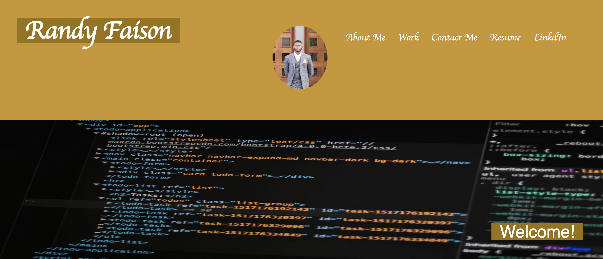

# Portfolio 

Full Stack Web Developer leveraging an Information Technology background to build a more intuitive user experience on the web. Recently earned a certificate in Full Stack Development from the University of Richmond, with newly developed skills in JavaScript, CSS, HTML, Node.Js, MySQL and responsive web design. Known as an innovative problem solver passionate about developing apps, with a focus on mobile-first design and development. With each project, my aim is to best engage my audience for an impactful user experience. 


The webb applications displayed so far are:

- Team Profile Generator Command Line Application

- Note Taker application

- Password Generator application


Technologies Used:

- 

## Team Profile Generator

This application takes in information about a team at a Software Engineering company. It then generates an HTML page to display all the information that was entered about the team. Also, all four of the class modules (employee, intern, manager, and engineer) are tested using Jest.

**User Story**

```md
AS A manager
I WANT to generate a webpage that displays my team's basic info
SO THAT I have quick access to their emails and GitHub profiles
```


 ## Note Taker

 This application was created to write, save, and delete notes. 
   
This application will use an Express.js back end and will save and retrieve note data from a JSON file.

The entire application is deployed to Heroku.

 **User Story**

```
AS A small business owner
I WANT to be able to write and save notes
SO THAT I can organize my thoughts and keep track of tasks I need to complete
```

Technologies Used:

- 

## Password Generator

In this application allows users to generate random passwords. Users are prompted to select criteria that they want their password to have.  

It features HTML, CSS, and Javascript. 


**User Story**

```
AS AN employee with access to sensitive data
I WANT to randomly generate a password that meets certain criteria
SO THAT I can create a strong password that provides greater security
```

Technologies Used:

- 


## Portfolio

    -Underneath the hood of my Portfolio I used HTML, CSS, along with a variety of tags, and a css file to create the formatting necessary for this site. 

        -The header of my page includes my title, picture, and links to the different sections of my page, link to my resume, and link to my LinkedIn. 
        
        -Followed by my "About me" bio.

        -Then I have three labeled picture links to my deployed applications, and links to the GitHub Repositories. 
        
        -Lastly followed by my contact information, with a link to my GitHub account. 

Contact Info: Randyfaison@gmail.com

The following picture gives a quick look into the application 




Link to Deployed wedsite:
https://randyfasion.github.io/RandyPortfolio/


Resume:


LinkdIn:
https://www.linkedin.com/in/randy-faison-47ab58183/

## Contact Information
Email: RandyFaison@gmail.com


- - -
## License
 [](https://opensource.org/licenses/MIT)
