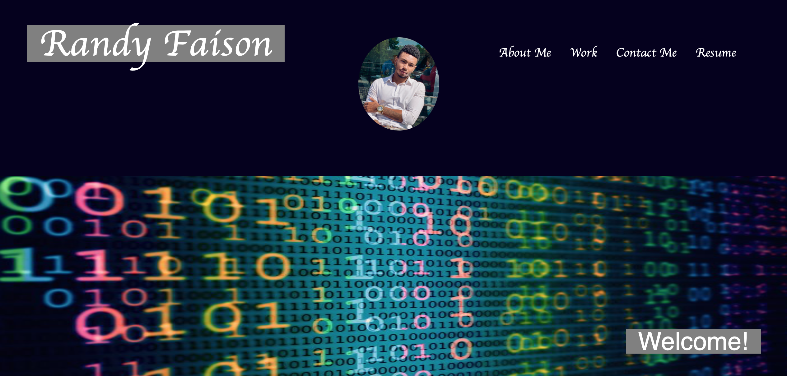

# 02 Advanced CSS: My Portfolio 

## Task

In this Portfolio I am showcasing my skill sets to potential employers looking to fill a full-time position. I have highlighted my strongest work thus far, this Portfolio is a deployed Webb application with a live link to the direct Website. 

The webb applications displayed so far are:

-Horiseon Homework 1 application

-Work Day Scheduler application

-Password Generator application

**Project 1 - Musical**

    -Our project has fulfilled the following:
 * Uses a CSS framework other than Bootstrap
 * Deployed to GitHub pages
 * Interactive 
 * Uses two server side API'S
 * Does not use alerts, confirms, or prompts
 * Use of client-side storage to store persistent data
 * Responsive (mobile-friendly)
 * Has a polished UI.
 * Has a clean repository that meets quality coding standards (file structure, naming conventions, follows best practices for class/id naming conventions, indentation, quality comments, etc.)
 * Has a quality README (with unique name, description, technologies used, screenshot, and link to deployed application).

 ## Acceptance Criteria
```
GIVEN I am a user looking to attend or learn about concerts ,Artist, near me, or any city in th USA
* WHEN I open the page,
* THEN I am presented with a search bar input by city. 
* WHEN I click the search button 
* THEN I am taken to another page that will display the results of my search,
* WHEN I choose the Artist 
* THEN I will be able to see all the live events and watch their YouTube videos .
 
```

 **Work Day Scheduler**

    -In this application I created a calendar that allows a user to save events for each hour of the day by modifying starter code.

    - I used the Momentjs library to work with the date and time. 

**Password Generator**

    -In this application I modified starter code to enable users to generate random passwords. Users are prompted to select criteria that they want their password to have.  

    -It features HTML, CSS, and Javascript. 

## Getting Started

**Portfolio**
    -Underneath the hood of my Portfolio I used HTML, CSS, along with a variety of tags, and a css file to create the formatting necessary for this site. 

        -The header of my page includes my title, picture, and links to the different sections of my page. 
        
        -Followed by my "About me" bio.

        -Then I have three labeled picture links to my deployed applications, and links to the GitHub Repositories. 
        
        -Lastly followed by my contact information, with a link to my GitHub account. 

Contact Info: Randyfaison@gmail.com

- The following link gives a quick look into the application 



Link to Deployed wedsite:
https://randyfasion.github.io/RandyPortfolio/

Link to GitHub Repository:
https://github.com/randyfasion/RandyPortfolio

Resume:


LinkdIn:
https://www.linkedin.com/in/randy-faison-47ab58183/
